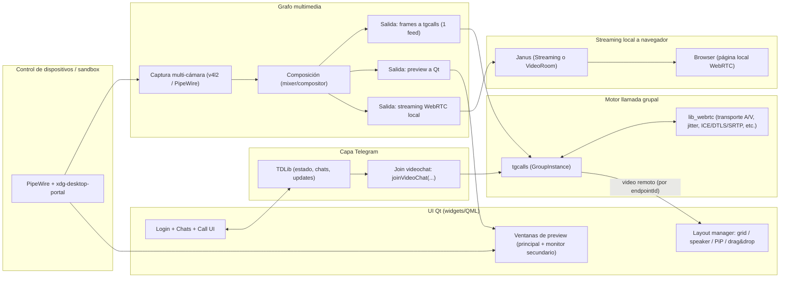

# Cliente Telegram para Linux con llamadas grupales, multicímera, composición y streaming WebRTC local

## Resumen ejecutivo

Construir un cliente de Telegram para Linux que **entre a llamadas grupales (videochats), seleccione una o varias cámaras, componga/reordene vistas, muestre previsualización en otro monitor y retransmita a un navegador local (WebRTC)** es viable, pero el éxito depende de separar claramente tres dominios: **(a) señalización/estado Telegram**, **(b) motor de llamada (audio/video en tiempo real)** y **(c) composición/ruteo multimedia**. La parte (a) se cubre con TDLib, que es un cliente completo que maneja networking, almacenamiento local y consistencia de datos. citeturn6search24 La parte (b) para videochats/grupales se alinea con el stack que usa Telegram Desktop: el repositorio oficial declara submódulos para tgcalls y lib_webrtc. citeturn5view0turn30view0 La parte (c) se resuelve de forma pragmática con un grafo multimedia (GStreamer) y/o con una capa de entrada/salida de frames hacia el motor de llamada y hacia la UI.

Un hallazgo clave para hacerlo “de verdad” (no sólo teórico) es que **la API de TDLib para unirse a un videochat** existe y explícitamente “devuelve un payload de respuesta para tgcalls”. citeturn28view0 Además, TDLib define que los **parámetros de join** (audio_source_id y payload) se “reciben de tgcalls”. citeturn29view0 Del lado de tgcalls, el API expone una interfaz de instancia grupal con métodos como `emitJoinPayload(...)` y `setJoinResponsePayload(...)`, y un descriptor con un `getVideoSource` para inyectar una fuente de video custom (ideal para tu composición multicímera). citeturn25view0turn25view2 Esto encaja directamente con tu requerimiento de “una o varias cámaras” y “composición arbitraria”: en vez de intentar que Telegram acepte múltiples tracks (limitación frecuente), puedes **componer múltiples cámaras en un solo feed saliente**.

Para el “streaming a navegador local (WebRTC)”, hay dos rutas sólidas:

- **Ruta A (MVP rápido)**: enviar RTP (H.264/Opus) desde GStreamer a **Janus Streaming plugin**, y consumir desde el navegador (Janus hace el “puente” a WebRTC). El propio plugin describe soporte para “live streaming de media generado por otra herramienta”. citeturn7search0turn8search7  
- **Ruta B (más flexible)**: publicar a **Janus VideoRoom** como publisher WebRTC (más complejo de señalización); el plugin requiere `publish` acompañado de una oferta SDP (“JSEP”). citeturn7search17turn7search2

Detalles no especificados por el usuario: distribución objetivo (p. ej. Ubuntu/Fedora/Arch), entorno gráfico (Wayland/X11), GPU/codec HW, número y tipo de cámaras, y si la app se empaquetará como Flatpak/Snap/paquete nativo.

## Arquitectura de referencia y responsabilidades de componentes

La arquitectura recomendada es **por capas y procesos**, para mantener eficiencia, seguridad y facilidad de depuración. TDLib se encarga del mundo Telegram; tgcalls/lib_webrtc se encargan de la llamada; y un grafo multimedia decide qué entra/sale, qué se compone, y qué se “clona” a otros destinos (preview/Janus).



Responsabilidades principales y “contratos” entre componentes:

- **TDLib**: mantener sesión, sincronizar chats/updates, exponer `chat.video_chat` y `group_call_id`, y ejecutar `joinVideoChat(...)` que devuelve un payload de respuesta para tgcalls. citeturn6search24turn6search7turn28view0  
- **tgcalls (GroupInstance)**:  
  - Generar el payload de *join request* hacia TDLib (`emitJoinPayload(...)`). citeturn25view0  
  - Consumir el *join response payload* que devuelve TDLib (`setJoinResponsePayload(...)`). citeturn25view0turn28view0  
  - Recibir/suministrar video: `getVideoSource` y sinks de salida/entrada para video (`addOutgoingVideoOutput`, `addIncomingVideoOutput(endpointId, ...)`). citeturn25view0turn25view2  
- **GStreamer** (o grafo equivalente): capturar varias fuentes, componer, y duplicar el resultado a (i) tgcalls, (ii) previews, (iii) Janus. La parte WebRTC de GStreamer se implementa con `webrtcbin` y requiere señalización (no se resuelve sólo con `gst-launch`). citeturn8search29turn3search31  
- **Janus**: servidor WebRTC “general purpose” desarrollado por entity["company","Meetecho","webrtc server vendor"]; expone interfaces HTTP/WebSocket para señalización (REST/WS). citeturn7search7turn7search1 El plugin VideoRoom es un SFU pub/sub y el publish es mediante SDP offer/answer. citeturn7search2turn7search17  
- **PipeWire + xdg-desktop-portal**: ruta recomendada si buscas sandbox y permisos granulares; el portal está diseñado para que apps contenidas accedan a recursos del sistema de forma “segura y bien definida”, y PipeWire implementa permisos por cliente sobre objetos del grafo. citeturn3search24turn3search17  

## Fuentes primarias y repositorios recomendados

Prioricé material oficial/primario (docs oficiales, repos upstream y código fuente). Cuando hay alternativa en español, la incluyo.

### Enlaces directos (priorizados)

```text
TDLib (docs + getting started)
- https://core.telegram.org/tdlib/getting-started
- https://core.telegram.org/tdlib/docs/classtd_1_1td__api_1_1join_video_chat.html
- https://core.telegram.org/tdlib/docs/classtd_1_1td__api_1_1group_call_join_parameters.html
- https://core.telegram.org/tdlib/docs/classtd_1_1td__api_1_1video_chat.html
- https://core.telegram.org/tdlib/docs/classtd_1_1td__api_1_1get_video_chat_streams.html

Telegram Desktop (referencia de integración real)
- https://github.com/telegramdesktop/tdesktop
- https://github.com/telegramdesktop/tdesktop/blob/dev/.gitmodules

tgcalls (lib oficial de llamadas, APIs para GroupInstance y video source)
- https://github.com/TelegramMessenger/tgcalls
- https://github.com/TelegramMessenger/tgcalls/blob/development/tgcalls/group/GroupInstanceImpl.h
- https://github.com/TelegramMessenger/tgcalls/blob/development/tgcalls/group/GroupJoinPayloadInternal.h
- https://github.com/TelegramMessenger/tgcalls/blob/development/tgcalls/FakeVideoTrackSource.h
- https://github.com/TelegramMessenger/tgcalls/blob/development/tgcalls/VideoCaptureInterface.h

lib_webrtc (helper library usada por Telegram Desktop)
- https://github.com/desktop-app/lib_webrtc

libtgvoip (alternativa histórica/terceros; revisar compatibilidad con grupo/video)
- https://github.com/grishka/libtgvoip

GStreamer (webrtcbin + ejemplos)
- https://gstreamer.freedesktop.org/documentation/webrtc/index.html
- https://github.com/centricular/gstwebrtc-demos   (demo histórico; archivado, pero útil)
- https://cgit.freedesktop.org/gstreamer/gst-examples/diff/?id=a028a4cb84d2c3591f422d6e0db42a6feb2bcda5  (sendrecv ejemplo)

Janus
- https://janus.conf.meetecho.com/
- https://janus.conf.meetecho.com/docs/rest.html
- https://janus.conf.meetecho.com/docs/videoroom
- https://janus.conf.meetecho.com/docs/streaming
- https://janus.conf.meetecho.com/docs/JS.html

PipeWire + Portals
- https://docs.pipewire.org/page_access.html
- https://flatpak.github.io/xdg-desktop-portal/docs/

Qt Multimedia + multi-monitor
- https://doc.qt.io/qt-6/qtmultimedia-index.html
- https://doc.qt.io/qt-6/es/qtmultimedia-index.html
- https://doc.qt.io/qt-6/es/videooverview.html
- https://doc.qt.io/qt-6/qvideoframeinput.html
- https://doc.qt.io/qt-6/qwindow.html
- https://doc.qt.io/qt-6/qscreen.html
```

Notas de relevancia (por qué importan estos links):

- `joinVideoChat` en TDLib es el pivote para entrar a videochats: documenta explícitamente que **retorna** payload de respuesta para tgcalls. citeturn28view0  
- `groupCallJoinParameters` define que `audio_source_id_` y `payload_` se **reciben de tgcalls** (esto valida la estrategia de “tgcalls emite → TDLib envía → TDLib devuelve respuesta → tgcalls aplica”). citeturn29view0turn25view0  
- Telegram Desktop es “la integración de referencia” porque su README declara que es el cliente oficial de escritorio basado en Telegram API/MTProto, y su árbol de submódulos referencia tgcalls y lib_webrtc. citeturn30view0turn5view0  
- En tgcalls, `GroupInstanceDescriptor::getVideoSource` habilita inyectar una fuente de video “custom” (ideal para tu composición) y `GroupInstanceInterface` expone `emitJoinPayload` / `setJoinResponsePayload` y sinks para video saliente/entrante por endpointId. citeturn25view0turn25view2  
- En Janus, VideoRoom es pub/sub (SFU) y `publish` requiere SDP offer/answer; el core ofrece diferentes interfaces (HTTP REST, WebSockets, etc.). citeturn7search2turn7search17turn7search1  
- PipeWire y Portals son la base moderna para compartir/capturar audio/video en Wayland y entornos sandboxed; PipeWire implementa permisos por cliente (punto fuerte para seguridad). citeturn3search17turn3search24  
- Qt: `QWindow::setScreen` es el método oficial para seleccionar pantalla/monitor objetivo (útil para tu preview en monitor secundario). citeturn26search0  

## Integración técnica con ejemplos de código

### Unirse a un videochat con TDLib y pasar el payload a tgcalls

**Idea:** tgcalls produce un `GroupJoinPayload` con `audioSsrc` y un JSON; ese JSON y el “audio source id” se pasan como `groupCallJoinParameters` a TDLib; TDLib ejecuta `joinVideoChat` y devuelve un `Text` con el “join response payload” para tgcalls. citeturn25view0turn29view0turn28view0turn17view3

Código (C++ orientado a Qt; simplificado para mostrar la mecánica clave):

```cpp
// NOTA: Snippet conceptual. Falta: manejo completo de updates TDLib, storage, threads, errores.
//       Lo importante es el flujo join: tgcalls emitJoinPayload -> TDLib joinVideoChat -> tgcalls setJoinResponsePayload.

#include <td/telegram/Client.h>
#include <td/telegram/td_api.h>

#include <tgcalls/group/GroupInstanceImpl.h>
#include <tgcalls/group/GroupInstanceCustomImpl.h>
#include <tgcalls/FakeVideoTrackSource.h>

#include <memory>
#include <iostream>

class TgClient {
public:
  TgClient() = default;

  void onAuthorized() {
    authorized_ = true;
    // En un cliente real, aquí cargarías chats y seleccionarías el chat objetivo.
  }

  td::Client& td() { return client_; }

  bool authorized() const { return authorized_; }

private:
  td::Client client_;
  bool authorized_ = false;
};

static td::td_api::object_ptr<td::td_api::Function> makeJoinVideoChat(
    int32_t groupCallId,
    int32_t audioSourceId,
    const std::string& joinPayloadJson,
    bool muted,
    bool myVideoEnabled,
    const std::string& inviteHash // si vienes de enlace; si no, suele usarse "" (validar en pruebas).
) {
  using namespace td::td_api;
  auto joinParams = make_object<groupCallJoinParameters>(audioSourceId, joinPayloadJson, muted, myVideoEnabled);
  // participant_id: null => unirse como "self" (según doc). invite_hash según internalLinkTypeVideoChat.
  // joinVideoChat: "Returns join response payload for tgcalls." (Text).
  return make_object<joinVideoChat>(groupCallId, nullptr, std::move(joinParams), inviteHash);
}

// --- Ejemplo de “video source” de prueba: un tablero de ajedrez generado por tgcalls ---
static std::function<webrtc::scoped_refptr<webrtc::VideoTrackSourceInterface>()>
makeFakeVideoSource() {
  // FakeVideoTrackSource::create devuelve una función que retorna un puntero estable a VideoTrackSourceInterface.
  // Internamente usa scoped_refptr para mantener vivo el objeto. citeturn31view1
  auto getterRaw = tgcalls::FakeVideoTrackSource::create(tgcalls::FrameSource::chess());

  // Adaptamos a la firma requerida por GroupInstanceDescriptor::getVideoSource (scoped_refptr). citeturn25view2
  auto cached = webrtc::scoped_refptr<webrtc::VideoTrackSourceInterface>(getterRaw());
  return [cached]() { return cached; };
}

int main() {
  TgClient tg;

  // 1) Construir GroupInstance (tgcalls) con fuente de video custom (aquí: chess demo).
  tgcalls::GroupInstanceDescriptor desc;
  desc.getVideoSource = makeFakeVideoSource(); // inyección de video (composición) citeturn25view2
  auto group = std::make_unique<tgcalls::GroupInstanceCustomImpl>(std::move(desc)); // API expuesta citeturn21view0

  // 2) Pedir a tgcalls el payload inicial para “join request”.
  group->emitJoinPayload([&](const tgcalls::GroupJoinPayload& jp) {
    // GroupJoinPayload contiene audioSsrc y json (payload). citeturn17view3
    const int32_t audioSourceId = static_cast<int32_t>(jp.audioSsrc);
    const std::string& joinPayloadJson = jp.json;

    // 3) Enviar joinVideoChat por TDLib.
    const int32_t groupCallId = /* obtener desde chat.video_chat.group_call_id_ */ 123456;
    auto req = makeJoinVideoChat(groupCallId, audioSourceId, joinPayloadJson,
                                /*muted=*/false, /*myVideoEnabled=*/true,
                                /*inviteHash=*/"");

    // En un cliente real, usa el loop de td::Client para enviar y leer respuestas.
    // Aquí es pseudo: tg.td().send({id, req});
    (void)req;
  });

  // 4) Cuando TDLib responde joinVideoChat con Text, pasar a tgcalls:
  // group->setJoinResponsePayload(textPayload);

  return 0;
}
```

Puntos a validar en implementación real:

- **Cómo obtienes `group_call_id`**: TDLib documenta que `videoChat.group_call_id_` es el identificador del group call activo y que el detalle completo se obtiene con `getGroupCall`. citeturn6search7turn6search0  
- **Cómo renderizar múltiples videos remotos**: tgcalls expone `addIncomingVideoOutput(endpointId, sink)` y además puedes pedir canales/calidades con `setRequestedVideoChannels(...)`. citeturn25view0turn25view2  
- **Streams disponibles**: TDLib provee `getVideoChatStreams(group_call_id)` para conocer streams disponibles. citeturn6search3  

### Selección de una o varias cámaras y composición con GStreamer

La estrategia recomendada (especialmente si quieres “varias cámaras” + layouts custom) es:

1. Capturar N cámaras (por ejemplo `v4l2src` para cada `/dev/videoX` o entrada vía PipeWire).  
2. Normalizar (scale/convert), aplicar overlays si quieres (nombre, borde, etc.).  
3. Componer con `compositor` (o equivalente).  
4. **Tee** a:
   - Appsink (para alimentar tgcalls como frames),
   - preview local (Qt o sink),
   - streaming local (RTP->Janus o WebRTC).

Pipeline ejemplo (composición 2 cámaras → salida H.264 RTP para Janus Streaming plugin + rama raw para appsink):

```bash
# EJEMPLO (ajusta device, resoluciones, framerate, encoder según HW).
# OJO: esto ilustra composición + salida RTP; no es el camino webrtcbin.
gst-launch-1.0 -e \
  compositor name=comp \
    sink_0::xpos=0   sink_0::ypos=0 sink_0::width=640 sink_0::height=360 \
    sink_1::xpos=640 sink_1::ypos=0 sink_1::width=640 sink_1::height=360 \
  ! video/x-raw,width=1280,height=720,framerate=30/1 \
  ! tee name=t \
  \
  v4l2src device=/dev/video0 ! videoconvert ! videoscale ! video/x-raw,width=640,height=360 ! queue ! comp.sink_0 \
  v4l2src device=/dev/video2 ! videoconvert ! videoscale ! video/x-raw,width=640,height=360 ! queue ! comp.sink_1 \
  \
  t. ! queue ! videoconvert ! x264enc tune=zerolatency speed-preset=ultrafast key-int-max=30 bitrate=2500 \
     ! rtph264pay config-interval=1 pt=96 ! udpsink host=127.0.0.1 port=5004 \
  \
  t. ! queue ! videoconvert ! video/x-raw,format=RGBA ! appsink name=frames_to_tgcalls sync=false max-buffers=2 drop=true
```

Por qué este patrón encaja con Janus:

- Janus Streaming plugin está diseñado para que “otra herramienta” genere la media y el plugin la redistribuya a peers WebRTC. citeturn7search0turn8search7  
- Para “webrtcbin puro” no basta con pipeline CLI: necesitas un componente de señalización (SDP/ICE). citeturn3search31turn8search29  

### Streaming WebRTC local con Janus

#### Opción rápida: Janus Streaming plugin (RTP in → WebRTC out)

Concepto:

- Tu app (GStreamer) envía RTP (H.264/Opus) a puertos locales.
- Janus Streaming plugin crea un stream “rtp” que escucha esos puertos.
- El navegador se conecta a Janus y reproduce (p. ej. usando el demo de Janus o tu propia UI con `janus.js`). El JS SDK existe para simplificar el flujo en browser. citeturn7search5turn7search21turn27search13  

La doc del Streaming plugin describe explícitamente el modo “live media generated by another tool”. citeturn7search0

Ejemplo mínimo de requests (HTTP REST) para crear sesión y adjuntar plugin (esquema conceptual; Janus usa transacciones y eventos async):

```bash
# Crear sesión
curl -s -X POST http://127.0.0.1:8088/janus \
  -H 'Content-Type: application/json' \
  -d '{ "janus":"create", "transaction":"t1" }'

# Adjuntar plugin streaming
curl -s -X POST http://127.0.0.1:8088/janus/<session_id> \
  -H 'Content-Type: application/json' \
  -d '{ "janus":"attach", "plugin":"janus.plugin.streaming", "transaction":"t2" }'
```

Janus documenta que soporta diferentes interfaces, incluyendo HTTP REST y WebSockets. citeturn7search1

> Nota práctica: en streaming plugin, lo común (operativamente) es **configurar los streams en el archivo de configuración** del plugin o crearlos vía API admin; el punto clave para tu diseño es que el plugin soporta RTP generado externamente. citeturn8search7turn7search0  

#### Opción más “WebRTC end-to-end”: Janus VideoRoom (publisher WebRTC)

Concepto:

- Tu app publica como “publisher” en un Room (SFU).
- Tus viewers (browser local) se suscriben.

La doc dice que VideoRoom es un SFU pub/sub y describe que para publicar debes enviar un `publish` que **debe venir con una oferta SDP (JSEP)** y recibes una respuesta SDP. citeturn7search2turn7search17

Pseudoflujo de mensajes (REST/WS):

```json
// 1) create session:  { "janus":"create", "transaction":"t1" }
// 2) attach:          { "janus":"attach", "plugin":"janus.plugin.videoroom", "transaction":"t2" }
// 3) join as pub:     { "janus":"message", "body": { "request":"join", "ptype":"publisher", "room":1234, "display":"compositor" }, "transaction":"t3" }
// 4) publish (JSEP):  { "janus":"message", "body": { "request":"publish", "audio":true, "video":true }, "jsep": { "type":"offer", "sdp":"..." }, "transaction":"t4" }
//    -> Janus responde con jsep answer
```

Y la interfaz de Janus para interactuar con una instancia (REST/WS) está documentada oficialmente. citeturn7search1turn7search5

> Atajo relevante: existen ejemplos de integración GStreamer ↔ Janus (VideoRoom) en demos comunitarios/ejemplos históricos (p. ej. gstwebrtc-demos). citeturn27search3turn27search0  

### Preview en Qt y salida a otro monitor

La salida a monitor secundario se resuelve con una **segunda ventana** (o un widget top-level) y asignarla a un `QScreen` específico.

- `QGuiApplication::screens()` te da la lista de pantallas. citeturn26search10  
- `QWindow::setScreen(QScreen*)` es el API oficial para asignar pantalla a una ventana (con nota importante sobre escritorios virtuales y `topLeft()`). citeturn26search0  

Snippet Qt (Widgets) para enviar un preview fullscreen a un segundo monitor:

```cpp
#include <QApplication>
#include <QWidget>
#include <QWindow>
#include <QGuiApplication>
#include <QScreen>

void showOnSecondMonitorFullscreen(QWidget *previewWindow) {
    previewWindow->show(); // crea windowHandle() en muchos casos
    const auto screens = QGuiApplication::screens(); // lista de pantallas citeturn26search10
    if (screens.size() < 2) {
        previewWindow->showFullScreen();
        return;
    }
    QWindow *w = previewWindow->windowHandle();
    w->setScreen(screens[1]); // setScreen es el mecanismo oficial citeturn26search0
    // Nota: si hay escritorio virtual, quizá debas mover relativo a screens[1]->geometry().topLeft().
    previewWindow->showFullScreen();
}
```

Para previsualizar frames compuestos:

- Qt Multimedia ofrece APIs C++/QML para video, cámara, screen/window capture y procesamiento de frames. citeturn8search33turn3search18  
- Si planeas “inyectar frames” desde tu compositor (GStreamer/appsink) hacia Qt, `QVideoFrameInput` (Qt 6.8+) está diseñado para “proveer frames custom” a un `QMediaCaptureSession`/salida de video o grabación. citeturn8search2  

Esto permite un modelo eficiente: **GStreamer compone** → appsink entrega → conviertes a `QVideoFrame` → `QVideoFrameInput` alimenta el preview en Qt (sin forzar que Qt sea tu compositor).

## Plan de integración y MVP

### Objetivo MVP funcional (en orden recomendado)

**MVP A (rápido, foco en “join + 1 feed compuesto + preview + stream local”)**

1. **Capa TDLib básica**: login, lista de chats, selección de chat objetivo. (Esfuerzo: medio) citeturn6search24  
2. **Detectar/obtener `group_call_id`** desde `chat.video_chat` y traer metadatos via `getGroupCall`. (Esfuerzo: medio) citeturn6search7turn6search0  
3. **Integrar tgcalls GroupInstance** para:
   - crear instancia,
   - `emitJoinPayload`,
   - `setJoinResponsePayload` con lo que devuelva TDLib `joinVideoChat`. (Esfuerzo: alto; riesgo: APIs y sincronización) citeturn25view0turn28view0  
4. **Composición mínima multi-cámara** (2 fuentes) con GStreamer y output a appsink. (Esfuerzo: medio; riesgo: performance/copies) citeturn3search31  
5. **Inyectar video compuesto a tgcalls** usando `GroupInstanceDescriptor::getVideoSource` (por ejemplo adaptando el patrón de `FakeVideoTrackSource`). (Esfuerzo: alto; riesgo: formatos, timestamps, threading) citeturn25view2turn23view0turn31view1  
6. **Preview local**: ventana Qt con display del feed compuesto (primera versión: simple). (Esfuerzo: bajo/medio) citeturn8search2turn26search0  
7. **Streaming a navegador local** con Janus Streaming plugin (RTP in). (Esfuerzo: medio; riesgo: codecs/latencia/config) citeturn7search0turn8search7  

**MVP B (si tu prioridad es “browser WebRTC” con menos piezas):** compón en GStreamer y publica directamente a browser con webrtcbin + signaling simple (basado en sendrecv demos). Esto reduce Janus, pero exige que tú mantengas el signaling. `webrtcbin` requiere código de señalización; los demos de `sendrecv` son referencia. citeturn8search29turn3search23turn8search4  

### Riesgos técnicos principales

- **Complejidad de integración tgcalls ↔ TDLib**: aunque las APIs encajan conceptualmente (payload de join), la implementación real exige control de threads, timing y “llamadas de vuelta” correctas. La interfaz de GroupInstance expone puntos claros, pero no evita la complejidad. citeturn25view0turn29view0turn28view0  
- **Formato y performance del video compuesto**: si haces múltiples copias CPU (RGBA→I420→WebRTC), puedes saturar CPU. El ejemplo de `FakeVideoTrackSource` convierte frames y usa buffers I420; es útil como patrón, pero para producción quizá necesites rutas con menos copias y/o aceleración. citeturn31view3turn31view1  
- **Wayland/sandbox**: acceso a cámara/screen requiere portales/PipeWire en muchos setups, especialmente en contenedores (Flatpak). citeturn3search24turn3search29  
- **Señalización WebRTC con Janus VideoRoom**: exige manejo correcto de transacciones, eventos async, SDP, trickle ICE, y compatibilidad de codecs permitidos por la sala. La doc indica explícitamente el requisito de SDP en `publish`. citeturn7search17turn7search2  

## Seguridad, hardening y sandboxing

### Separación de procesos y “least privilege”

Recomendación fuerte: ejecutar el cliente como **múltiples procesos** (o al menos separar “media pipeline” del UI) y aplicar políticas diferentes.

- **Proceso UI + TDLib**: acceso a red Telegram, almacenamiento local de sesión y base de datos; superficie de ataque: parsing de updates, archivos descargados, etc. TDLib ya encapsula “networking, local storage, data consistency”, pero tu app decide permisos del proceso y cómo arma el sandbox. citeturn6search24  
- **Proceso media (tgcalls + composición)**: acceso a mic/cámara/screen y codecs. Ideal para aislarlo con sandbox estricto (seccomp, namespaces, AppArmor/SELinux, o empaquetado Flatpak).  
- **Servidor local Janus**: si lo incluyes, que escuche en `127.0.0.1` y con medidas de configuración (admin secrets, puertos cerrados). Janus expone varias interfaces; reduce superficie deshabilitando las que no uses (p. ej. no habilitar admin remoto). citeturn7search1turn7search7  

### Portals y PipeWire para permisos granulares

Si apuntas a “seguro por defecto” (y/o Flatpak), apóyate en:

- **XDG Desktop Portal**: diseñado para integración segura con el sistema (apps contenidas). citeturn3search24  
- **PipeWire access control**: modelo de permisos por cliente/objeto (R/W/X/M) en el grafo multimedia, útil para minimizar acceso a dispositivos y streams. citeturn3search17  

En práctica, esto ayuda a implementar:

- Solicitudes explícitas de cámara/screen share (sin acceso permanente a `/dev/video*`).
- Revocación de permisos en runtime (dependiendo del backend/portal).

### Recomendaciones específicas para manejo de media

- Normalizar inputs (resolución, framerate) antes de componer para evitar picos de CPU.
- Limitar buffers (colas cortas + `drop=true` en appsink) para mantener latencia baja.
- Deshabilitar o restringir parsers/decoders que no necesitas en el proceso media (reduce superficie de codecs).
- Logs: evitar que dumps de SDP/ICE o tokens terminen en logs persistentes; en especial si implementas signaling propio.

## Pruebas, checklist y depuración

### Checklist de pruebas funcionales (orientado a tu caso)

- **Autenticación y sesión**
  - Login, reconexión, y recuperación tras reinicio.
  - Manejo correcto del estado de videochat en `chat.video_chat` y updates relacionados. citeturn6search7turn6search18  

- **Join y estabilidad de llamada**
  - `emitJoinPayload` → `joinVideoChat` → `setJoinResponsePayload` (happy path y errores).
  - Reconexión tras pérdida de red (Wi‑Fi→Ethernet).
  - Mutear audio y (re)activar video con los flags de `groupCallJoinParameters`. citeturn29view0turn25view0  

- **Multicímera y layouts**
  - Selección de N cámaras.
  - Re-layout en runtime (grid ↔ speaker ↔ PiP) sin reiniciar call.
  - Drag&drop para reorganizar tiles (validar que el compositor realmente reubica sin glitches).

- **Preview multi-monitor**
  - Ventana secundaria en pantalla correcta con `QWindow::setScreen`, incluidos escritorios virtuales. citeturn26search0turn26search10  

- **Streaming local a navegador**
  - Janus Streaming: latencia, estabilidad, reconexión del browser.
  - Janus VideoRoom: publish/subscribe básico y compatibilidad de codecs / fitting con room config. citeturn7search2turn7search17  

### Herramientas y tips de debug (prácticos)

- **GStreamer**
  - Usar `GST_DEBUG` por categorías (por ejemplo `webrtc*:6` cuando uses webrtcbin).
  - Recordar que `webrtcbin` no se “cierra” sólo con pipeline CLI; toma como guía demos sendrecv. citeturn3search31turn8search4  

- **Janus**
  - Habilitar logs de plugin (streaming/videoroom) y verificar el orden de eventos (JSEP offer/answer, trickle ICE).
  - Confirmar que el navegador usa el mismo endpoint/config y que los demos de Janus apuntan a tu servidor. citeturn7search5turn27search13  

- **Qt**
  - Para multi-monitor, respetar la nota de `setScreen`: en escritorios virtuales debes posicionar usando `topLeft()` del `QScreen`. citeturn26search0  
  - Validar que el backend multimedia elegido soporta el flujo (si usas `QVideoFrameInput`, revisar compatibilidad/limitaciones del backend en tu versión). citeturn8search2  

## Proyectos para estudiar y tablas de decisión

### Proyectos open-source a inspeccionar/forkar

- Telegram Desktop como referencia “real” de integración (cliente oficial) y dependencias de WebRTC/tgcalls. citeturn30view0turn5view0  
- tgcalls (headers de GroupInstance, payloads y video source) — particularmente `GroupInstanceImpl.h`, `GroupJoinPayloadInternal.h`, `FakeVideoTrackSource.*`. citeturn25view2turn18view0turn23view0turn31view1  
- Demos de GStreamer WebRTC (“sendrecv”) — el repo de entity["company","Centricular","gstreamer consultancy"] (aunque está archivado) sigue siendo excelente para entender señalización y callbacks del webrtc plugin, y está citado como base en varios hilos. citeturn8search0turn8search4turn3search31  
- Janus demos y documentación oficial; `janus.js` es el SDK recomendado para browser-side. citeturn7search5turn7search18turn7search0  

### Tabla comparativa: libtgvoip vs tgcalls/lib_webrtc para llamadas

| Criterio | libtgvoip | tgcalls/lib_webrtc |
|---|---|---|
| Evidencia de uso en Telegram Desktop | No aparece como submódulo principal en `.gitmodules` de tdesktop (en la versión revisada). | Sí: tdesktop declara submódulos para `tgcalls` y `lib_webrtc`. citeturn5view0 |
| Enfoque aparente | VoIP “clásico”; el repo incluye piezas tipo `VoIPGroupController` (indicio de soporte de grupo/voice chat). citeturn2search24 | Llamadas modernas (incl. videochat): TDLib `joinVideoChat` devuelve payload para tgcalls y `groupCallJoinParameters` se reciben desde tgcalls. citeturn28view0turn29view0 |
| Integración con TDLib para videochats | No documentada en TDLib como path principal para `joinVideoChat`. | Está explícitamente alineada con TDLib (`payload` y `audio_source_id` provienen de tgcalls). citeturn29view0 |
| Capacidad de inyectar video compuesto | No claro (depende del API, no demostrado aquí). | Sí: `GroupInstanceDescriptor::getVideoSource` y sinks de video por endpoint. citeturn25view2turn25view0 |
| Riesgo de “desfase” con Telegram actual | Medio/alto (depende de compatibilidad). | Menor, por estar en la ruta declarada por TDLib y usada en Telegram Desktop. citeturn28view0turn5view0 |

### Tabla comparativa: Janus vs servidor propio (webrtcbin + signaling)

| Criterio | Janus | webrtcbin + signaling propio |
|---|---|---|
| Modelo | Servidor WebRTC general purpose con arquitectura de plugins; hace de “enable” para browser y enruta RTP/RTCP. citeturn7search7 | Tu app es “el servidor” (al menos de signaling); `webrtcbin` es el endpoint WebRTC dentro de tu proceso. citeturn8search29turn3search31 |
| Complejidad inicial | Media (instalar/configurar + aprender API). | Media/alta (debes implementar signaling robusto y seguridad). |
| Publicación a múltiples viewers | Muy buena (VideoRoom SFU o Streaming plugin). citeturn7search2turn7search0 | Requiere que tú implementes multi-peer (o replique streams) si quieres más de un viewer. |
| Camino “MVP” | Streaming plugin (RTP in) puede ser rápido si ya produces RTP. citeturn7search0turn8search7 | Un demo tipo sendrecv puede ser rápido para 1 viewer, pero escalar a N viewers complica. citeturn8search4turn3search31 |
| Seguridad | Puedes aislar Janus como proceso, limitar a localhost y deshabilitar interfaces. citeturn7search1 | Todo queda dentro de tu proceso; aumenta superficie y responsabilidad de hardening. |

### Stack recomendado

**Para MVP rápido (prioridad “funciona pronto”):**

- TDLib + tgcalls/lib_webrtc (ruta alineada con Telegram Desktop) para unirse a videochats. citeturn28view0turn5view0  
- Composición en GStreamer (N cámaras → 1 feed) + inyección a tgcalls vía `getVideoSource`. citeturn25view2turn31view1  
- Streaming local: RTP → Janus Streaming plugin (browser consume WebRTC vía Janus). citeturn7search0turn8search7  
- Preview multi-monitor: Qt con `QWindow::setScreen`. citeturn26search0  

**Para versión full-featured (prioridad “calidad y extensibilidad”):**

- Misma base TDLib + tgcalls/lib_webrtc. citeturn29view0turn25view0  
- Canalización media separada por procesos + PipeWire/Portals para permisos y captura en entornos sandbox. citeturn3search24turn3search17  
- Streaming local WebRTC: Janus VideoRoom (pub/sub, múltiples viewers) si quieres escalabilidad y control fino. citeturn7search2turn7search17  
- UI avanzada de layouts: sistema de escenas (grid/speaker/PiP) con drag&drop y persistencia de layouts.

En ambos casos, una observación estratégica: si tu caso de uso incluye “broadcast” más que interacción, TDLib también contempla la creación de videochat tipo RTMP (`createVideoChat(..., is_rtmp_stream)`) y en el esquema TDLib se listan métodos para obtener/reemplazar RTMP URL del videochat. Esto sugiere un camino alterno para ciertos modos “streaming” hacia Telegram, aunque no sustituye la experiencia de “unirse como participante” con tgcalls. citeturn6search2turn6search26